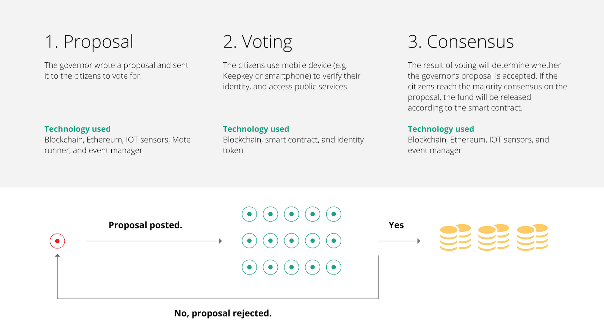

# Consensus 2015 Makeathon Project

## Description

A prototype for a decentralized blockchain-based governing platform developed in less than 24 hours during CoinDesk's Consensus 2015 makeathon. 

The project allows citizens or members of any organization to vote proposals created by elected officials. 

First, an elected official submits a proposal for voting. In our prototype the proposal is a budget-allocation plan. The proposal is then converted to a decentralized contract on the Ethereum blockchain to hold the budget funds in escrow. 

Second, individual citizens vote on the proposal and decide whether they accept or reject the proposal. Voting is accomplished by submitting specialized "vote-coins" to the Ethereum contract that represents the proposal. Voting also require a government/organization issued identification hardware to verify identity and provide the citizen's private-key.

Lastly, once a consensus is reached, the funds are either released automatically by the Ethereum contract or the proposal is rejected. 

## Screenshots

Mock-up of what the application could look like on a laptop browser.

Mock-up of what the application could look like on mobile.

Actual screen from live prototype showing the voting process and the integration with a hardware cryptocurrency wallet.  

## Features

+ Creates decentralized contracts on the Ethereum blockchain (using the BlockApps API).
+ Integrates with the KeepKey hardware wallet to read private-keys and verify identity (accomplished with Python).
+ Runs a user-friendly web-application that facilitates voting and reduces the complexity of interfacing with blockchains (using Ruby on Rails).

## Authors

- [Charles Crain](https://github.com/charlescrain)

- Avalon Hu

- [Walter Beller-Morales](https://github.com/walterbm)

- Mario Salazar

## License

MIT Licensed. See LICENSE for details.